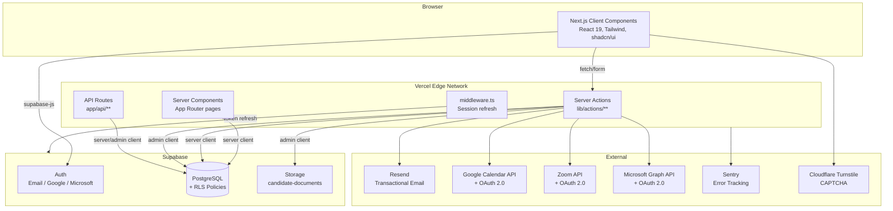

# HRHandle — System Architecture Overview

_Last updated: 2026-05-08_

## Changelog

- 🆕 CV-parsing service (Google Generative AI / Gemini) introduced as a new external dependency for `/api/parse-cv`
- 🆕 LinkedIn (manual page-ID integration) added to external services
- 🆕 Three new tables (`candidate_experience`, `candidate_education`, `organization_integrations`) extend the candidate / integrations domains
- 🆕 Vercel Analytics added (client-side `<Analytics />` in `app/layout.tsx`)

---

## High-Level Architecture



## Request Data Flow

### Authenticated Page Request
1. Browser requests `/candidates` (for example).
2. `middleware.ts` calls `updateSession()` which refreshes the Supabase JWT cookie if needed.
3. `app/(dashboard)/layout.tsx` (Server Component):
   - Calls `supabase.auth.getUser()`.
   - Fetches profile and subscription.
   - Checks if onboarding needed → calls `runOnboarding()`.
   - Checks if trial expired → redirects to `/subscription`.
4. `app/(dashboard)/candidates/page.tsx` fetches data server-side.
5. HTML streamed to browser with React hydration.

### Server Action Call
1. Client component calls server action (e.g., `createCandidate(input)`).
2. Server action calls `getAuthContext()` → validates session, fetches org.
3. Zod schema validation.
4. Plan limit check if creating a resource.
5. Supabase query scoped to `orgId`.
6. `revalidatePath()` to invalidate Next.js cache.
7. Returns `ActionResult<T>`.

### OAuth Integration Flow (Google/Zoom/Microsoft)
1. User clicks "Connect" → GET `/api/auth/[provider]`.
2. Route generates CSRF `state` token, stores in httpOnly cookie, redirects to provider.
3. Provider redirects back to `/api/auth/[provider]/callback`.
4. Callback verifies state, exchanges code for tokens, stores tokens in `profiles` table via admin client.
5. Redirect to settings with `?provider=connected` query param.

## Folder Structure

```
app/
  (dashboard)/          # Authenticated app (layout checks auth + onboarding)
    candidates/         # Candidate CRUD, detail view
    vacancies/          # Vacancy CRUD, pipeline, detail view
    interviews/         # Interview list, schedule form
    settings/           # All settings subpages
    subscription/       # Plan selection
    dashboard/          # Dashboard home page
  api/
    auth/               # OAuth routes for Google, Zoom, Microsoft
    cron/               # Scheduled jobs (expire-vacancies)
    export/             # CSV download endpoints
    health/             # Health check
    onboarding/         # POST — delegates to lib/onboarding.ts
  auth/                 # Public auth pages (login, sign-up, etc.)
  apply/                # Public candidate application form
  jobs/                 # Public vacancy listings by org slug
  join/                 # Team invitation acceptance
  page.tsx              # Landing page (redirects to dashboard or shows landing)
  layout.tsx            # Root layout with ThemeProvider, Toaster, Sentry
  robots.ts             # Robots.txt
  sitemap.ts            # XML sitemap
components/
  apply/                # Public apply form component
  auth/                 # Sign-up form, session guard, sign-out button
  candidates/           # All candidate-related UI
  custom-fields/        # Custom field display and form components
  dashboard/            # Sidebar, header, notifications bell, trial banner
  interviews/           # Interview form, actions, time display
  landing/              # Pricing section (public landing page)
  pipeline/             # Kanban board, column, candidate card, rejection dialog
  settings/             # All settings panel components
  shared/               # Column manager, filter tabs
  subscription/         # Plan cards
  theme-provider.tsx    # next-themes wrapper
  ui/                   # shadcn/ui primitives (accordion, button, card, etc.)
  vacancies/            # All vacancy-related UI
lib/
  actions/              # Server actions per domain (candidates, vacancies, etc.)
  cache/                # Next.js unstable_cache wrappers for lookup tables
  google/               # Google Calendar + OAuth utilities
  microsoft/            # Microsoft Graph + OAuth utilities
  zoom/                 # Zoom OAuth + meetings
  supabase/             # client / server / admin / middleware factory functions
  types/                # TypeScript interfaces and type constants
  validations/          # Zod schemas (candidate, vacancy, interview, etc.)
  campaign.ts           # Campaign pricing logic
  email-template-utils.ts # applyVariables, escapeHtml, DEFAULT_TEMPLATES
  email.ts              # Resend email sending functions
  env.ts                # t3-oss/env-nextjs validated environment variables
  onboarding.ts         # Org + profile + subscription creation
  session.ts            # localStorage session preference helpers
  utils.ts              # cn() Tailwind merge utility
hooks/
  use-mobile.ts         # Responsive breakpoint hook
  use-toast.ts          # Toast notification hook
__tests__/
  validations.test.ts   # Existing validation tests (do not modify)
scripts/
  001_create_schema.sql … 025_*.sql   # Migration history
```

## Security Headers

Set globally in `next.config.mjs` for all routes:
- `X-Frame-Options: DENY`
- `X-Content-Type-Options: nosniff`
- `Strict-Transport-Security: max-age=63072000; includeSubDomains; preload`
- `Content-Security-Policy`: restricts scripts, styles, images, connections
- `Referrer-Policy: strict-origin-when-cross-origin`
- `Permissions-Policy: camera=(), microphone=(), geolocation=()`
