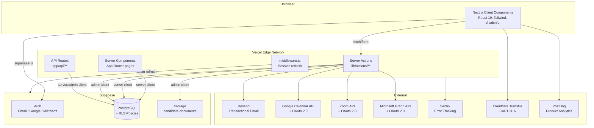

# HRHandle — System Architecture Overview

_Last updated: 2026-06-26_

## Changelog

- 🆕 Phase 9 tech debt pass — partial (G-033, AC-012, C-012). **9.1 WCAG**: bumped `--muted-foreground` in light mode (oklch L 0.5 → 0.45) so body muted-text passes WCAG AA contrast on the default card background. Added `aria-label` to every icon-only Button missing one across candidate, vacancy, interview, document, and report surfaces (back-arrow links, more-actions dropdowns, trash/edit buttons). Semantic landmarks (`<main>`, `<aside>`, `<nav>`, `<header>` in dashboard layout) already in place — no changes needed. **9.2 Strict tsconfig**: turned on `noUncheckedIndexedAccess` which surfaced 139 errors initially; worked through all of them. Pattern-fixed the recurring `parsed.error.errors[0].message` idiom across 8 action files and the `MODELS[i]` access in 6 AI generator files. Test mock-call destructures (e.g. `fetchMock.mock.calls[0][0]`) use non-null assertions since the assertion site has just verified the call count. Real app code uses nullish guards (`array[i] ?? default`) or explicit `if (!entry) return null`. `exactOptionalPropertyTypes` deferred — it produced ~25 cosmetic prop-type compatibility errors (mostly Radix wrappers + page→form pass-through) that aren't worth the churn until a focused follow-up. **9.3 Component splits + react-hook-form migration**: deferred to its own session — `components/vacancies/vacancy-form.tsx` (656 LOC) and `app/(dashboard)/candidates/page.tsx` (541 LOC) need careful migration since form validation + submit + conditional rendering all live in inline state, and rushing it would risk behavior regressions in the most-used surfaces. **9.4 Keyset pagination**: parked indefinitely — no customer is near the ~5K row trigger; revisit when a slow list query shows up in PostHog or Sentry rather than pre-emptively.
- 🆕 2FA / TOTP (G-032, Phase 6.1). New `/settings/profile` includes a Two-factor authentication card: enroll a TOTP authenticator (Google Authenticator, 1Password, Authy, etc.), list active factors, remove. Supabase Auth provides the QR-code SVG + secret via `auth.mfa.enroll({factorType:'totp'})` so we don't need a third-party `qrcode` lib. New `/auth/mfa-challenge` page handles the post-login second-factor flow: after password the session is at `aal1`, we run `mfa.challenge` + `mfa.verify` to elevate to `aal2`. Org owners get a policy card on `/settings/organization` with two checkboxes — **require 2FA for everyone** and **require 2FA for owners and admins only** — independent flags; org-wide implies admin-only on the UI. Middleware (`lib/supabase/middleware.ts`) gates dashboard routes: if a user is enrolled and the session is at `aal1`, redirect to `/auth/mfa-challenge?next=<path>`; if org policy requires MFA for this user and they haven't enrolled, redirect to `/settings/profile?enforce=mfa`. Exempts profile/auth/api routes so the user can actually reach the surfaces that resolve the redirect. Migration 042 adds `organizations.require_mfa`, `organizations.require_mfa_for_admins`, and `profiles.mfa_enrolled` (a cached flag the server actions sync on enroll + unenroll + admin reset, so the middleware doesn't need an extra `listFactors` round-trip per request). Admin recovery path on `/settings/team`: a small "Reset 2FA" button next to each non-owner member calls `adminResetUserFactors` (uses `supabase.auth.admin.listFactors` + `mfa.deleteFactor`); the targeted user is then forced through fresh enrollment on next sign-in. Self-unenroll blocked when org policy still requires MFA for the user (unless they have a second verified factor). Pure helpers `lib/mfa/policy.ts` (`evaluatePolicy`, `needsChallenge`) and `lib/mfa/factors.ts` (`verifiedFactors`, `hasVerifiedFactor`, `defaultFactorName`, `normalizeTotpCode`, `isValidTotpCode`) with 22 unit tests covering every policy × role × enrollment combination, AAL classification edge cases, and code-input normalization. 4 new audit events: `mfa_enrolled`, `mfa_removed`, `mfa_admin_reset`, `mfa_policy_updated`. WebAuthn / passkeys and recovery codes intentionally deferred — TOTP is universal and the admin-reset path covers the lost-phone recovery use case. SAML SSO (Phase 6.2) intentionally deferred until an enterprise customer asks; would use WorkOS rather than building SAML from scratch.
- 🆕 Slack + Teams notifications and Calendly integration (G-030, G-031, Phase 5). **Webhooks (Slack / Teams)** — new `webhook_notifications` table (migration 040, org-scoped, admin-managed via RLS) lets admins register multiple Slack or Teams incoming webhooks per org and pick which events each subscribes to. Fan-out is best-effort: `dispatchWebhookNotification(orgId, event, ctx)` loads active webhooks, filters by event, POSTs in parallel, swallows network errors, and writes a single audit row per dispatch (count only — never logs payload bodies or destination URLs). Wired into the public-apply flow (`application_received`), `updateApplicationStatus` (`application_hired`, `application_rejected`, `application_withdrawn` — only when the transition actually changes status, never on no-ops), `sendOffer` (`offer_sent`), `acceptOfferByToken`/`declineOfferByToken` (`offer_accepted` / `offer_declined`), `withdrawApplicationByToken` (`application_withdrawn`), and the Calendly webhook receiver (`interview_scheduled`). Eight canonical events with per-webhook on/off checkboxes; default subset is `application_received` + `application_hired` + `offer_accepted`. Test-message button on the webhooks settings page validates the URL end-to-end before relying on a real event. Payload builders construct Slack Block Kit (`section` blocks + a primary-style Open-in-HRHandle button when there's a URL) and Teams MessageCard JSON (sections.facts for structured fields + an OpenUri action) from a common `WebhookEventContext` shape. URL validation gates obvious typos (Slack must point at `hooks.slack.com`; Teams accepts the various Microsoft webhook hostnames). **Calendly** — new `lib/calendly/` module wraps the OAuth2 flow (`/api/auth/calendly` start, `/api/auth/calendly/callback`), token-refresh-on-expiry, user-scoped webhook subscription at connect time (`invitee.created` + `invitee.canceled`), and HMAC-SHA256 signature verification on incoming webhooks with a 5-minute timestamp tolerance against replay. Connect dialog: admin authorizes Calendly → HRHandle records access + refresh tokens + signing key on `organization_integrations` (migration 041 extends the existing LinkedIn-only schema with `refresh_token`, `webhook_subscription_id`, `webhook_signing_key`, `selected_event_type_uri`, `selected_event_type_name`, `external_user_uri`) → admin picks one event type from their Calendly account on the settings page. Recruiter on any candidate's evaluation panel sees a "Calendly link" button that calls `buildCalendlyLinkForApplication` — server-side it re-fetches the event type's current `scheduling_url`, appends `?name=&email=&utm_source=hrhandle&utm_medium=recruiter_link&utm_content=<application_id>`, returns the URL for copy/paste. When the candidate books, Calendly POSTs to `/api/webhooks/calendly` → we verify the HMAC against the org's stored signing key, look up the application via `utm_content`, insert an interview row, audit-log as `interview_scheduled`, and fan out the webhook notification to subscribed Slack/Teams channels. Disconnect deletes the upstream webhook subscription + best-effort revokes both tokens before NULLing the local row. `CALENDLY_CLIENT_ID` + `CALENDLY_CLIENT_SECRET` env vars added with lenient validation (matches existing OAuth provider pattern). 34 unit tests across the four pure helpers (`payload-builders`, `events`, `link-builder`, `webhook-verify` — covers Slack block shape, Teams MessageCard shape, URL hostname gates, UTM round-trip, HMAC verify pass/fail/tampered/wrong-key/expired). Manual deployment steps (Slack app, Teams Incoming Webhook connector, Calendly OAuth app registration, Vercel env vars, both DB migrations) collected in `docs/4-integrations/phase-5-manual-steps.md`.
- 🆕 Reports — pipeline funnel, time-to-hire, source effectiveness (G-029, Phase 4). New `/reports` route with three sub-pages: **Pipeline conversion** (cumulative funnel applied → screening → interview → offer → hired with stage-to-stage conversion rates), **Time to hire** (median + p25/p75 + mean across applications hired in the period, plus per-vacancy breakdown), and **Source effectiveness** (applications/hires/conversion grouped by `source_type`). Period selector: 7/30/90/365 days + all-time; URL-driven via `?period=`. Visible to every signed-in member (no admin gate — the underlying data is already org-readable). Migration 039 backfills `applications.source_type = 'manual'` on existing NULL rows + adds DEFAULT 'manual' so future recruiter-created apps without an explicit source tag automatically. `createCandidate` (linked-vacancy path) + `addApplicationToCandidate` now pass `source_type: 'manual'` explicitly. Funnel uses `activity_log.action = 'status_changed'` history so a rejected application that previously reached interview still counts toward interview. Time-to-hire uses the earliest `status_changed → hired` event timestamp per application. Pure helpers in `lib/reports/` (period, funnel, time-to-hire, source-summary) with 40 unit tests. Recharts (~80KB gzipped) added as a dep — used only on the pipeline funnel chart for now. No real-time updates / no PDF export / no recruiter-productivity metrics (deliberately skipped per roadmap).
- 🆕 Bulk CSV candidate import (G-028, Phase 3.7). Admin-only `/candidates/import` page with a multi-step wizard (Upload → Map → Preview → Done). Static template at `public/hrhandle-candidates-template.csv` so recruiters never have to guess column names. Client-side parse via papaparse, then server `importCandidates` re-validates every row via the same Zod schema (`lib/candidate-import/validation.ts`) before insert. Auto-mapping infers field from header aliases (`First Name` ↔ `firstname` ↔ `first_name`). Duplicate handling: emails already present in the org (or duplicated within the batch) are skipped silently, surfaced as a count + list on the result screen. Plan-cap enforced once per batch — refuses the whole import if `current + batch > candidate_limit`. Caps: 1000 rows / 5MB. Per-row errors collected in a downloadable error CSV. Single audit row `candidates_imported` with `{ rows_attempted, rows_imported, rows_skipped_duplicate, filename }`. 31 unit tests across parsing + validation. No new schema — reuses existing nullable candidate columns including `current_company` / `current_position` / `years_of_experience` which the table already has even though the manual form doesn't expose them yet.
- 🐛 Five-fix bundle (G-027). (a) `<TablePagination>` refactored from a `buildHref(opts) => string` function prop to serialisable `basePath` + `preservedParams` props; the function prop tripped React 19's "Functions cannot be passed directly to Client Components" RSC error, breaking the audit-log page and back-navigation to the candidates list. (b) Added `useEffect` re-sync on `initialApplications` / `initialQuestions` in `CandidateApplicationsList` + `VacancyQuestions` so a `router.refresh()` from a child (offer create, assessment-suggester Add) actually flows fresh data into local state — previously `useState(initialProp)` only read its initial value on first mount, leaving the visible state stale until a manual F5. (c) Removed the AI email drafter (G-015) — code, route, tests, mount, and the recruiter-managed templates already cover the customer-facing email needs. Privacy §5.1, ROPA P-3, ai-features.md, roadmap all updated. Historical `activity_log` rows with `feature: 'email_drafter'` preserved as immutable audit history.
- 🆕 Saved filter views (G-026, Phase 3.6). New `saved_views` table (migration 038) per-user-per-list-kind with UNIQUE on `(user_id, list_kind, name)` + per-user RLS scoping reads/writes to the caller. Pure helpers in `lib/saved-views/` (`encodeParams`, `decodeParams`, `paramsAreEqual`, `buildHrefForView`, `normalizeViewName`) normalise URL params before persistence + comparison so pagination + default sort don't trigger a false "modified" badge. 21 unit tests. Five server actions (list / save / update params / rename / delete) all audit-logged. New `<SavedViewsMenu>` slots into both list-page toolbars (candidates + vacancies); renders saved views with a check on the active one, an inline `Update / Rename / Delete` block on the active row, and a `Save current` ghost button when filters are typed but no view matches. Cross-org sharing deferred — first pass is per-user.
- 🆕 Scorecard sharing (G-025, Phase 3.8). Recruiters can share a candidate's evaluation with a non-HRHandle stakeholder (hiring manager, exec) via a token-gated public URL at `/scorecard/<token>`. Third token-page in a row, same risk model as G-016 (status) and G-018 (offer): URL is the credential, admin-client lookup, robots-noindex, 404 on missing/revoked/soft-deleted parents. Migration 037 adds `scorecard_token` + `scorecard_revoked_at` + `shared_by` + `shared_at` to `candidate_evaluations`. Pure `projectScorecard` helper (10 unit tests) assembles the public view: filters unanswered questions, sorts by question `sort_order`, clamps out-of-range scores. Public page shows candidate full name + role + employer + overall score + per-question score bars (1–10) or text answers. Hides everything else (contact, status, notes, AI, offers, audit). Three actions: `getOrCreateScorecardToken` (lazy generate, stable first-sharer attribution across revoke/re-share), `revokeScorecardToken`, `getScorecardByToken`. Owner+admin only. Mounted as a small "Share" button next to the per-application evaluation block on the candidate detail page.
- 🆕 Bulk move-to-stage (G-024, Phase 3.5). The vacancy applications bulk-action toolbar gains a "Move to stage ▾" dropdown next to the existing Reject button. New `moveApplicationsBatch` action loops the per-row `updateApplicationStatus` so audit-log + candidate-status sync + opt-in status-change auto-email all keep working unchanged. Skip rows already at the target (no-op audit would be noise). 50-row cap. Confirm dialog shows the count + target stage + a clear "an email might fire" disclaimer. Result toast classifies outcomes via the pure `partitionByOutcome` helper. 8 unit tests. Reject + withdrawn deliberately not in the dropdown — each has its own dedicated flow.
- 🆕 Global search palette (G-023, Phase 3.4). Cmd-K / Ctrl-K / "/" opens a `<CommandDialog>` palette searching candidates, vacancies, and notes in parallel. `ilike` over multiple columns rather than tsvector full-text — at HRHandle's current scale that's instantaneous and avoids the trigger-keeps-tsvector-in-sync risk. Pure helpers in `lib/search/query.ts` (`normalizeQuery`, `escapeForIlike`, `toIlikePattern`) with 14 unit tests. Server action `globalSearch` runs three parallel queries via `Promise.all`; over-fetches notes 2× to compensate for the post-join filter that drops notes whose candidate has been soft-deleted. New `<GlobalSearchDialog>` (debounced 200ms, ref-based race guard, `shouldFilter={false}` so cmdk doesn't hide server-fetched rows) and `<SearchTrigger>` (header pill with platform shortcut hint, `useEffect`-deferred platform detection avoids hydration mismatch; `/` only fires when no input is focused). `CommandDialog` extended to forward `shouldFilter` to the inner `Command`. Mounted in the dashboard header.
- 🆕 @-mentions in notes + candidate self-withdraw (G-021, G-022, Phase 3 bundle A). New `candidate_notes.mentions UUID[]` column (migration 036) records teammate ids tagged via @-mention in note text. Pure helpers in `lib/notes/mentions.ts` cover the tokenize-for-display and id-revalidation paths (16 unit tests). New `<MentionTextarea>` adds an @-keystroke typeahead on top of the existing Textarea — no external dep, ~200 LOC. `createNote` now revalidates client-supplied ids against the live member list + the note text, drops self-mentions, and fires `note_mention` notifications via `createOrgNotifications`. AI note-extractor unchanged (defaults to empty mentions array). New `withdrawApplicationByToken` (token-gated, admin-client, mirrors G-016 risk model) lets a candidate withdraw from the public status page; cancels any active offer so a stale Accept button doesn't reappear; audit-logged as `application_withdrawn` with `via: 'candidate_token'`; notifies recruiter owners + admins. Mounted as `<WithdrawButton>` below the stepper on `/status/<token>` only when the bucket is non-terminal.
- 🆕 Audit-log viewer + Trash (G-019, G-020, Phase 1 of operational completeness). Two new admin-only pages under `/settings/`: **Audit log** reads `activity_log` (already populated by every meaningful action) with filters for action, entity type, user, date range, paginated via the existing `<TablePagination>`, with CSV export. **Trash** lists soft-deleted candidates + vacancies with per-row Restore and Delete-now actions; restoring a candidate also un-deletes the applications cascade-deleted with them (BL-007's audit row carries the IDs). `restored_at` / `restored_by` populated on un-delete. Pure helpers (`lib/audit-log/filter.ts`, `lib/trash/impact.ts`) with 20 unit tests. Restore + hard-delete each write a new audit row (`candidate_restored`, `vacancy_restored`, `candidate_hard_deleted`, `vacancy_hard_deleted`). Email-tracking toggle deferred — Resend's tracking is configured per-domain on their dashboard, not per-send, so an in-product toggle without two-domain infra would be misleading.
- 🆕 Offer process (G-018, Phase 2). New `offers` table (migration 035) with the minimal schema philosophy: only `role_title` + `body` are required; compensation amount/currency/period, start date, respond-by date, and recruiter note are all optional structured fields; everything else lives in the plain-text body. Recruiter creates an offer attached to an application, saves as draft or sends; sending generates a `public_token` and emails the candidate. Candidate-facing page at `/offer/<token>` (robots-noindex, admin-client lookup, same risk model as G-016 status page) lets the candidate Accept or Decline directly. On Accept the application stays in the **Offer** stage with the offer marked accepted — the hire is NOT automatic (changed 2026-08-21, #N8): the recruiter finalizes it with an explicit **Mark as Hired** button on the profile (`markApplicationHired` → `updateApplicationStatus`, so the candidate-status sync + audit + hired notification/webhook still fire). State machine: `draft → sent → (accepted | declined | expired | withdrawn)`. One non-terminal offer per application enforced via partial unique index; revising after sending means withdraw + create new. Daily purge cron auto-expires `sent` offers past their `expiry_date`. Pure helpers in `lib/offers/` (state guards + TZ-stable expiry check) with 13 unit tests. Email template type `offer_sent` added to `email_templates`; admins edit via the existing `/settings/email-templates` page. Audit log records `offer_created`/`offer_sent`/`offer_accepted`/`offer_declined`/`offer_withdrawn`/`offer_expired` with offer + application IDs only — body content never logged.
- 🆕 Dashboard loading skeletons (BL-006). Every page under `app/(dashboard)/` had zero `loading.tsx` files so clicks felt unresponsive while server queries ran (600–1500ms on detail pages with parallel fan-out). New `components/ui/page-skeleton.tsx` composes a small kit on the existing `<Skeleton>` primitive (`PageHeaderSkeleton`, `ToolbarSkeleton`, `FilterPillsSkeleton`, `TableSkeleton`, `PaginationSkeleton`, plus block/circle/text primitives). New `loading.tsx` files for the five heaviest routes: vacancies list + detail, candidates list + detail, dashboard. Skeletons mirror the real chrome (column counts, sidebar shape, tab strip) so the swap-in is CLS-free.
- 🆕 Candidate-delete cascade + accurate confirmation (BL-007). `deleteCandidate` now soft-deletes the candidate's active applications first (`UPDATE … RETURNING id`), then the candidate, then writes a `candidate_deleted` audit row with the affected application IDs so a future restore action can scope its undo. Previously the candidate row was soft-deleted alone and the applications stayed visible on vacancy pipelines as "Unknown candidate" rows for 30 days. New `getCandidateDeleteImpact` action returns the active application count; new shared `<DeleteCandidateDialog>` used by both delete entry points (detail-page button and list-row dropdown — the dropdown uses Radix `onSelect={e.preventDefault()}` so the menu doesn't close before the dialog opens) shows accurate copy ("X active applications will also be removed; reversible by admin within 30 days"). Removed the misleading "applications will remain on the vacancies" and "cannot be undone" copy. Pure helper `buildCandidateDeleteAuditDetails` with 5 unit tests.
- 🆕 List-pagination controls (F-009 follow-up). Both candidates and vacancies lists already paged via `.range(from, to)` + `count: 'exact'`, but the UI was Prev/Next-only with a locked page size. New `lib/pagination.ts` exposes a pure window calculator (`getPageWindow`) and a clamped `parsePageSize`. New `components/ui/table-pagination.tsx` renders "Showing X–Y of Z" + per-page selector (20/50/100) + windowed page-number list with ellipses on `sm+` (compact "Page N of M" on narrow screens) + Prev/Next with proper aria. Caller-supplied `buildHref` keeps URL construction next to the filters/sort it needs to preserve. Keyset/cursor pagination + cheaper `count: 'planned'` are still the next scale step but no current customer is near that threshold.
- 🆕 Status-change auto-emails (G-017). Per-org opt-in, per-template-type toggle. When a recruiter moves an application forward into the `screening` or `interview` stage and the org has saved + enabled the matching template, `updateApplicationStatus` fires `sendApplicationStatusChangedEmail` with a link back to the candidate's status page. Off by default for every org — admins opt in via `/settings/email-templates` per stage. Pure transition gating lives in `lib/applications-status-emails.ts:shouldEmailForTransition` (forward-only via `application_statuses.sort_order`; only `screening` and `interview` qualify; rejection/withdrawn/offer/hired/applied skip). New migration 034: extends `email_templates.template_type` CHECK + adds `is_enabled BOOLEAN DEFAULT TRUE`. New action `setEmailTemplateEnabled`; `saveEmailTemplate` preserves existing `is_enabled` (defaults to `false` for opt-in types on first save). Audit log records `action: 'status_change_email_sent'` per send.
- 🆕 Candidate-facing status page (G-016). Public, token-gated URL at `/status/<token>` showing the abstracted bucket (Applied / In review / Interview / Decision / Closed) for one application. Per-application `public_token` column on `applications` (migration 033) generated at every INSERT path (public apply, recruiter add-to-vacancy, candidate-form linked vacancy). Bucket mapping in `lib/application-status-bucket.ts` collapses the seven `application_statuses.code` values into the five candidate-facing buckets (rejection deliberately rendered as neutral "Closed" — the page never delivers a rejection). Apply-confirmation email now includes a "Track your application" CTA pointing at the candidate's status URL. Recruiters can re-share the link from the application row on the candidate detail page (Copy-link icon button). Status page is `robots: noindex` and uses the admin client for token lookup (same risk model as `application_form_token` on vacancies). No login required.
- 🆕 AI-assisted hiring features framework (`lib/ai/`). First feature: candidate summary (`/api/ai/candidate-summary` + `<AiSummaryPanel>`). Second feature: JD generator (`/api/ai/jd-generator` + `<AiJdSuggest>` in `<VacancyForm>`) with per-section Generate + explicit "Apply all to form". Third feature: interview questions (`/api/ai/interview-questions` + `<AiInterviewQuestions>` in a new tab on the vacancy detail page) with 4 categories, per-question Copy, and explicit "Save to vacancy" persistence to a new `vacancies.interview_questions` JSONB column (migration 032). Fourth feature: interview-note structuring (`/api/ai/note-extractor` + `<AiNotesExtractor>` in the right sidebar of the candidate detail page) — recruiter pastes free-text notes, AI extracts summary/strengths/concerns/skills/follow-ups, per-section Copy + explicit "Save as note". **Retired 2026-08-28 — route + `lib/ai/note-extractor.ts` + `<AiNotesExtractor>` removed by product decision; it was the only AI feature sending candidate personal data, so its removal leaves all remaining AI modules vacancy-side or redaction-based.** Fifth feature: inclusive-language check (`/api/ai/bias-check` + `<AiBiasCheck>` in `<VacancyForm>` below the JD generator) — Run-check button scans the JD text for biased phrasing and returns findings with suggested replacements; form is never modified. Sixth feature: assessment suggester (`/api/ai/assessment-suggester` + `<AiAssessmentSuggester>` mounted full-width above the Questionary + Evaluation Criteria cards on the vacancy Assessment tab) — Generate produces skill labels + open-ended prompts; per-item Add calls the existing `addVacancyQuestion` action, so each persisted row goes through the same path as manual entry. **Email drafter (G-015) shipped 2026-06-09 then retired 2026-06-21 — the recruiter-managed templates already covered the customer-facing email needs and the AI output didn't earn its keep.** Six design principles in `docs/9-compliance/ai-features.md` (advisory-only, no auto-fill, no auto-decision, every call audit-logged). Tracked as G-009 (framework + candidate summary), G-010 (JD generator), G-011 (interview questions), G-012 (note extractor), G-013 (bias check), G-014 (assessment suggester). Existing CV parsing brought under the same framework.
- 🆕 OAuth sign-up now routes first-time Google/Microsoft users through `/onboarding/company` to collect their name + company name (dashboard layout intercepts when `user_metadata.company_name` is missing). Email sign-up unchanged.
- 🆕 PostHog product analytics added (client-side provider in `app/providers.tsx`, EU cloud, production-only). CSP allow-lists PostHog EU hosts.
- 🆕 CV-parsing service (Google Generative AI / Gemini) introduced as a new external dependency for `/api/parse-cv`
- 🆕 LinkedIn (manual page-ID integration) added to external services
- 🆕 Three new tables (`candidate_experience`, `candidate_education`, `organization_integrations`) extend the candidate / integrations domains
- 🆕 Vercel Analytics added (client-side `<Analytics />` in `app/layout.tsx`)

---

## High-Level Architecture



## Request Data Flow

### Authenticated Page Request
1. Browser requests `/candidates` (for example).
2. `middleware.ts` calls `updateSession()` which refreshes the Supabase JWT cookie if needed.
3. `app/(dashboard)/layout.tsx` (Server Component):
   - Calls `supabase.auth.getUser()`.
   - Fetches profile and subscription.
   - If `profile.organization_id` is missing: redirects to `/join?token=...` (pending invite), else to `/onboarding/company` (no `user_metadata.company_name` — typical for OAuth sign-up), else calls `runOnboarding()` (email sign-up with company name already in metadata).
   - Checks if trial expired → redirects to `/subscription`.
4. `app/(dashboard)/candidates/page.tsx` fetches data server-side.
5. HTML streamed to browser with React hydration.

### Server Action Call
1. Client component calls server action (e.g., `createCandidate(input)`).
2. Server action calls `getAuthContext()` → validates session, fetches org.
3. Zod schema validation.
4. Plan limit check if creating a resource.
5. Supabase query scoped to `orgId`.
6. `revalidatePath()` to invalidate Next.js cache.
7. Returns `ActionResult<T>`.

### OAuth Integration Flow (Google/Zoom/Microsoft)
1. User clicks "Connect" → GET `/api/auth/[provider]`.
2. Route generates CSRF `state` token, stores in httpOnly cookie, redirects to provider.
3. Provider redirects back to `/api/auth/[provider]/callback`.
4. Callback verifies state, exchanges code for tokens, stores tokens in `profiles` table via admin client.
5. Redirect to settings with `?provider=connected` query param.

## Folder Structure

```
app/
  (dashboard)/          # Authenticated app (layout checks auth + onboarding)
    candidates/         # Candidate CRUD, detail view
    vacancies/          # Vacancy CRUD, pipeline, detail view
    interviews/         # Interview list, schedule form
    settings/           # All settings subpages
    subscription/       # Plan selection
    dashboard/          # Dashboard home page
  api/
    auth/               # OAuth routes for Google, Zoom, Microsoft
    cron/               # Scheduled jobs (expire-vacancies)
    export/             # CSV download endpoints
    health/             # Health check
    onboarding/         # POST — delegates to lib/onboarding.ts
  auth/                 # Public auth pages (login, sign-up, etc.)
  onboarding/           # Post-OAuth company-name collection (authenticated, outside dashboard layout)
    company/            # /onboarding/company — server action completeCompanyOnboarding
  apply/                # Public candidate application form
  jobs/                 # Public vacancy listings by org slug
  join/                 # Team invitation acceptance
  page.tsx              # Landing page (redirects to dashboard or shows landing)
  layout.tsx            # Root layout with ThemeProvider, Toaster, Sentry
  providers.tsx         # PostHog provider + App Router pageview tracking
  robots.ts             # Robots.txt
  sitemap.ts            # XML sitemap
components/
  analytics/            # PostHog identify component
  apply/                # Public apply form component
  auth/                 # Sign-up form, session guard, sign-out button
  onboarding/           # Company-onboarding form (post-OAuth)
  candidates/           # All candidate-related UI
  custom-fields/        # Custom field display and form components
  dashboard/            # Sidebar, header, notifications bell, trial banner
  interviews/           # Interview form, actions, time display
  landing/              # Pricing section (public landing page)
  pipeline/             # Kanban board, column, candidate card, rejection dialog
  settings/             # All settings panel components
  shared/               # Column manager, filter tabs
  subscription/         # Plan cards
  theme-provider.tsx    # next-themes wrapper
  ui/                   # shadcn/ui primitives (accordion, button, card, etc.)
  vacancies/            # All vacancy-related UI
lib/
  actions/              # Server actions per domain (candidates, vacancies, etc.)
  ai/                   # AI-assisted features (Gemini) — advisory-only, button-triggered
  cache/                # Next.js unstable_cache wrappers for lookup tables
  google/               # Google Calendar + OAuth utilities
  microsoft/            # Microsoft Graph + OAuth utilities
  zoom/                 # Zoom OAuth + meetings
  supabase/             # client / server / admin / middleware factory functions
  types/                # TypeScript interfaces and type constants
  validations/          # Zod schemas (candidate, vacancy, interview, etc.)
  analytics.ts          # PostHog typed capture() helper
  campaign.ts           # Campaign pricing logic
  email-template-utils.ts # applyVariables, escapeHtml, DEFAULT_TEMPLATES
  email.ts              # Resend email sending functions
  env.ts                # t3-oss/env-nextjs validated environment variables
  onboarding.ts         # Org + profile + subscription creation
  session.ts            # localStorage session preference helpers
  utils.ts              # cn() Tailwind merge utility
hooks/
  use-mobile.ts         # Responsive breakpoint hook
__tests__/
  validations.test.ts   # Existing validation tests (do not modify)
scripts/
  001_create_schema.sql … 025_*.sql   # Migration history
```

## Security Headers

Set globally in `next.config.mjs` for all routes:
- `X-Frame-Options: DENY`
- `X-Content-Type-Options: nosniff`
- `Strict-Transport-Security: max-age=63072000; includeSubDomains; preload`
- `Content-Security-Policy`: restricts scripts, styles, images, connections
- `Referrer-Policy: strict-origin-when-cross-origin`
- `Permissions-Policy: camera=(), microphone=(), geolocation=()`
