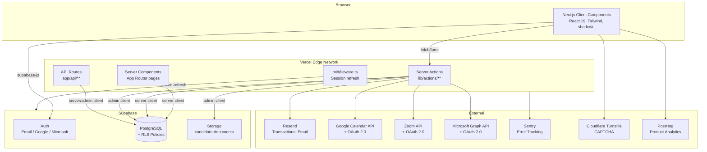

# HRHandle — System Architecture Overview

_Last updated: 2026-06-18_

## Changelog

- 🆕 Global search palette (G-023, Phase 3.4). Cmd-K / Ctrl-K / "/" opens a `<CommandDialog>` palette searching candidates, vacancies, and notes in parallel. `ilike` over multiple columns rather than tsvector full-text — at HRHandle's current scale that's instantaneous and avoids the trigger-keeps-tsvector-in-sync risk. Pure helpers in `lib/search/query.ts` (`normalizeQuery`, `escapeForIlike`, `toIlikePattern`) with 14 unit tests. Server action `globalSearch` runs three parallel queries via `Promise.all`; over-fetches notes 2× to compensate for the post-join filter that drops notes whose candidate has been soft-deleted. New `<GlobalSearchDialog>` (debounced 200ms, ref-based race guard, `shouldFilter={false}` so cmdk doesn't hide server-fetched rows) and `<SearchTrigger>` (header pill with platform shortcut hint, `useEffect`-deferred platform detection avoids hydration mismatch; `/` only fires when no input is focused). `CommandDialog` extended to forward `shouldFilter` to the inner `Command`. Mounted in the dashboard header.
- 🆕 @-mentions in notes + candidate self-withdraw (G-021, G-022, Phase 3 bundle A). New `candidate_notes.mentions UUID[]` column (migration 036) records teammate ids tagged via @-mention in note text. Pure helpers in `lib/notes/mentions.ts` cover the tokenize-for-display and id-revalidation paths (16 unit tests). New `<MentionTextarea>` adds an @-keystroke typeahead on top of the existing Textarea — no external dep, ~200 LOC. `createNote` now revalidates client-supplied ids against the live member list + the note text, drops self-mentions, and fires `note_mention` notifications via `createOrgNotifications`. AI note-extractor unchanged (defaults to empty mentions array). New `withdrawApplicationByToken` (token-gated, admin-client, mirrors G-016 risk model) lets a candidate withdraw from the public status page; cancels any active offer so a stale Accept button doesn't reappear; audit-logged as `application_withdrawn` with `via: 'candidate_token'`; notifies recruiter owners + admins. Mounted as `<WithdrawButton>` below the stepper on `/status/<token>` only when the bucket is non-terminal.
- 🆕 Audit-log viewer + Trash (G-019, G-020, Phase 1 of operational completeness). Two new admin-only pages under `/settings/`: **Audit log** reads `activity_log` (already populated by every meaningful action) with filters for action, entity type, user, date range, paginated via the existing `<TablePagination>`, with CSV export. **Trash** lists soft-deleted candidates + vacancies with per-row Restore and Delete-now actions; restoring a candidate also un-deletes the applications cascade-deleted with them (BL-007's audit row carries the IDs). `restored_at` / `restored_by` populated on un-delete. Pure helpers (`lib/audit-log/filter.ts`, `lib/trash/impact.ts`) with 20 unit tests. Restore + hard-delete each write a new audit row (`candidate_restored`, `vacancy_restored`, `candidate_hard_deleted`, `vacancy_hard_deleted`). Email-tracking toggle deferred — Resend's tracking is configured per-domain on their dashboard, not per-send, so an in-product toggle without two-domain infra would be misleading.
- 🆕 Offer process (G-018, Phase 2). New `offers` table (migration 035) with the minimal schema philosophy: only `role_title` + `body` are required; compensation amount/currency/period, start date, respond-by date, and recruiter note are all optional structured fields; everything else lives in the plain-text body. Recruiter creates an offer attached to an application, saves as draft or sends; sending generates a `public_token` and emails the candidate. Candidate-facing page at `/offer/<token>` (robots-noindex, admin-client lookup, same risk model as G-016 status page) lets the candidate Accept or Decline directly — on Accept, the application moves to `hired` via the existing pipeline path so the candidate-status sync + audit log + (opt-in) status-change email all just work. State machine: `draft → sent → (accepted | declined | expired | withdrawn)`. One non-terminal offer per application enforced via partial unique index; revising after sending means withdraw + create new. Daily purge cron auto-expires `sent` offers past their `expiry_date`. Pure helpers in `lib/offers/` (state guards + TZ-stable expiry check) with 13 unit tests. Email template type `offer_sent` added to `email_templates`; admins edit via the existing `/settings/email-templates` page. Audit log records `offer_created`/`offer_sent`/`offer_accepted`/`offer_declined`/`offer_withdrawn`/`offer_expired` with offer + application IDs only — body content never logged.
- 🆕 Dashboard loading skeletons (BL-006). Every page under `app/(dashboard)/` had zero `loading.tsx` files so clicks felt unresponsive while server queries ran (600–1500ms on detail pages with parallel fan-out). New `components/ui/page-skeleton.tsx` composes a small kit on the existing `<Skeleton>` primitive (`PageHeaderSkeleton`, `ToolbarSkeleton`, `FilterPillsSkeleton`, `TableSkeleton`, `PaginationSkeleton`, plus block/circle/text primitives). New `loading.tsx` files for the five heaviest routes: vacancies list + detail, candidates list + detail, dashboard. Skeletons mirror the real chrome (column counts, sidebar shape, tab strip) so the swap-in is CLS-free.
- 🆕 Candidate-delete cascade + accurate confirmation (BL-007). `deleteCandidate` now soft-deletes the candidate's active applications first (`UPDATE … RETURNING id`), then the candidate, then writes a `candidate_deleted` audit row with the affected application IDs so a future restore action can scope its undo. Previously the candidate row was soft-deleted alone and the applications stayed visible on vacancy pipelines as "Unknown candidate" rows for 30 days. New `getCandidateDeleteImpact` action returns the active application count; new shared `<DeleteCandidateDialog>` used by both delete entry points (detail-page button and list-row dropdown — the dropdown uses Radix `onSelect={e.preventDefault()}` so the menu doesn't close before the dialog opens) shows accurate copy ("X active applications will also be removed; reversible by admin within 30 days"). Removed the misleading "applications will remain on the vacancies" and "cannot be undone" copy. Pure helper `buildCandidateDeleteAuditDetails` with 5 unit tests.
- 🆕 List-pagination controls (F-009 follow-up). Both candidates and vacancies lists already paged via `.range(from, to)` + `count: 'exact'`, but the UI was Prev/Next-only with a locked page size. New `lib/pagination.ts` exposes a pure window calculator (`getPageWindow`) and a clamped `parsePageSize`. New `components/ui/table-pagination.tsx` renders "Showing X–Y of Z" + per-page selector (20/50/100) + windowed page-number list with ellipses on `sm+` (compact "Page N of M" on narrow screens) + Prev/Next with proper aria. Caller-supplied `buildHref` keeps URL construction next to the filters/sort it needs to preserve. Keyset/cursor pagination + cheaper `count: 'planned'` are still the next scale step but no current customer is near that threshold.
- 🆕 Status-change auto-emails (G-017). Per-org opt-in, per-template-type toggle. When a recruiter moves an application forward into the `screening` or `interview` stage and the org has saved + enabled the matching template, `updateApplicationStatus` fires `sendApplicationStatusChangedEmail` with a link back to the candidate's status page. Off by default for every org — admins opt in via `/settings/email-templates` per stage. Pure transition gating lives in `lib/applications-status-emails.ts:shouldEmailForTransition` (forward-only via `application_statuses.sort_order`; only `screening` and `interview` qualify; rejection/withdrawn/offer/hired/applied skip). New migration 034: extends `email_templates.template_type` CHECK + adds `is_enabled BOOLEAN DEFAULT TRUE`. New action `setEmailTemplateEnabled`; `saveEmailTemplate` preserves existing `is_enabled` (defaults to `false` for opt-in types on first save). Audit log records `action: 'status_change_email_sent'` per send.
- 🆕 Candidate-facing status page (G-016). Public, token-gated URL at `/status/<token>` showing the abstracted bucket (Applied / In review / Interview / Decision / Closed) for one application. Per-application `public_token` column on `applications` (migration 033) generated at every INSERT path (public apply, recruiter add-to-vacancy, candidate-form linked vacancy). Bucket mapping in `lib/application-status-bucket.ts` collapses the seven `application_statuses.code` values into the five candidate-facing buckets (rejection deliberately rendered as neutral "Closed" — the page never delivers a rejection). Apply-confirmation email now includes a "Track your application" CTA pointing at the candidate's status URL. Recruiters can re-share the link from the application row on the candidate detail page (Copy-link icon button). Status page is `robots: noindex` and uses the admin client for token lookup (same risk model as `application_form_token` on vacancies). No login required.
- 🆕 AI-assisted hiring features framework (`lib/ai/`). First feature: candidate summary (`/api/ai/candidate-summary` + `<AiSummaryPanel>`). Second feature: JD generator (`/api/ai/jd-generator` + `<AiJdSuggest>` in `<VacancyForm>`) with per-section Generate + explicit "Apply all to form". Third feature: interview questions (`/api/ai/interview-questions` + `<AiInterviewQuestions>` in a new tab on the vacancy detail page) with 4 categories, per-question Copy, and explicit "Save to vacancy" persistence to a new `vacancies.interview_questions` JSONB column (migration 032). Fourth feature: interview-note structuring (`/api/ai/note-extractor` + `<AiNotesExtractor>` in the right sidebar of the candidate detail page) — recruiter pastes free-text notes, AI extracts summary/strengths/concerns/skills/follow-ups, per-section Copy + explicit "Save as note". Fifth feature: inclusive-language check (`/api/ai/bias-check` + `<AiBiasCheck>` in `<VacancyForm>` below the JD generator) — Run-check button scans the JD text for biased phrasing and returns findings with suggested replacements; form is never modified. Sixth feature: assessment suggester (`/api/ai/assessment-suggester` + `<AiAssessmentSuggester>` mounted full-width above the Questionary + Evaluation Criteria cards on the vacancy Assessment tab) — Generate produces skill labels + open-ended prompts; per-item Add calls the existing `addVacancyQuestion` action, so each persisted row goes through the same path as manual entry. Seventh feature: email drafter (`/api/ai/email-drafter` + `<AiEmailDrafter>` in the candidate detail page right rail) — generate-from-scratch and improve-my-draft modes for rejection / interview invite / offer / follow-up / custom emails; output is `{subject, body}` the recruiter copies into their email tool; no send action. Six design principles in `docs/9-compliance/ai-features.md` (advisory-only, no auto-fill, no auto-decision, every call audit-logged). Tracked as G-009 (framework + candidate summary), G-010 (JD generator), G-011 (interview questions), G-012 (note extractor), G-013 (bias check), G-014 (assessment suggester), G-015 (email drafter). Existing CV parsing brought under the same framework.
- 🆕 OAuth sign-up now routes first-time Google/Microsoft users through `/onboarding/company` to collect their name + company name (dashboard layout intercepts when `user_metadata.company_name` is missing). Email sign-up unchanged.
- 🆕 PostHog product analytics added (client-side provider in `app/providers.tsx`, EU cloud, production-only). CSP allow-lists PostHog EU hosts.
- 🆕 CV-parsing service (Google Generative AI / Gemini) introduced as a new external dependency for `/api/parse-cv`
- 🆕 LinkedIn (manual page-ID integration) added to external services
- 🆕 Three new tables (`candidate_experience`, `candidate_education`, `organization_integrations`) extend the candidate / integrations domains
- 🆕 Vercel Analytics added (client-side `<Analytics />` in `app/layout.tsx`)

---

## High-Level Architecture



## Request Data Flow

### Authenticated Page Request
1. Browser requests `/candidates` (for example).
2. `middleware.ts` calls `updateSession()` which refreshes the Supabase JWT cookie if needed.
3. `app/(dashboard)/layout.tsx` (Server Component):
   - Calls `supabase.auth.getUser()`.
   - Fetches profile and subscription.
   - If `profile.organization_id` is missing: redirects to `/join?token=...` (pending invite), else to `/onboarding/company` (no `user_metadata.company_name` — typical for OAuth sign-up), else calls `runOnboarding()` (email sign-up with company name already in metadata).
   - Checks if trial expired → redirects to `/subscription`.
4. `app/(dashboard)/candidates/page.tsx` fetches data server-side.
5. HTML streamed to browser with React hydration.

### Server Action Call
1. Client component calls server action (e.g., `createCandidate(input)`).
2. Server action calls `getAuthContext()` → validates session, fetches org.
3. Zod schema validation.
4. Plan limit check if creating a resource.
5. Supabase query scoped to `orgId`.
6. `revalidatePath()` to invalidate Next.js cache.
7. Returns `ActionResult<T>`.

### OAuth Integration Flow (Google/Zoom/Microsoft)
1. User clicks "Connect" → GET `/api/auth/[provider]`.
2. Route generates CSRF `state` token, stores in httpOnly cookie, redirects to provider.
3. Provider redirects back to `/api/auth/[provider]/callback`.
4. Callback verifies state, exchanges code for tokens, stores tokens in `profiles` table via admin client.
5. Redirect to settings with `?provider=connected` query param.

## Folder Structure

```
app/
  (dashboard)/          # Authenticated app (layout checks auth + onboarding)
    candidates/         # Candidate CRUD, detail view
    vacancies/          # Vacancy CRUD, pipeline, detail view
    interviews/         # Interview list, schedule form
    settings/           # All settings subpages
    subscription/       # Plan selection
    dashboard/          # Dashboard home page
  api/
    auth/               # OAuth routes for Google, Zoom, Microsoft
    cron/               # Scheduled jobs (expire-vacancies)
    export/             # CSV download endpoints
    health/             # Health check
    onboarding/         # POST — delegates to lib/onboarding.ts
  auth/                 # Public auth pages (login, sign-up, etc.)
  onboarding/           # Post-OAuth company-name collection (authenticated, outside dashboard layout)
    company/            # /onboarding/company — server action completeCompanyOnboarding
  apply/                # Public candidate application form
  jobs/                 # Public vacancy listings by org slug
  join/                 # Team invitation acceptance
  page.tsx              # Landing page (redirects to dashboard or shows landing)
  layout.tsx            # Root layout with ThemeProvider, Toaster, Sentry
  providers.tsx         # PostHog provider + App Router pageview tracking
  robots.ts             # Robots.txt
  sitemap.ts            # XML sitemap
components/
  analytics/            # PostHog identify component
  apply/                # Public apply form component
  auth/                 # Sign-up form, session guard, sign-out button
  onboarding/           # Company-onboarding form (post-OAuth)
  candidates/           # All candidate-related UI
  custom-fields/        # Custom field display and form components
  dashboard/            # Sidebar, header, notifications bell, trial banner
  interviews/           # Interview form, actions, time display
  landing/              # Pricing section (public landing page)
  pipeline/             # Kanban board, column, candidate card, rejection dialog
  settings/             # All settings panel components
  shared/               # Column manager, filter tabs
  subscription/         # Plan cards
  theme-provider.tsx    # next-themes wrapper
  ui/                   # shadcn/ui primitives (accordion, button, card, etc.)
  vacancies/            # All vacancy-related UI
lib/
  actions/              # Server actions per domain (candidates, vacancies, etc.)
  ai/                   # AI-assisted features (Gemini) — advisory-only, button-triggered
  cache/                # Next.js unstable_cache wrappers for lookup tables
  google/               # Google Calendar + OAuth utilities
  microsoft/            # Microsoft Graph + OAuth utilities
  zoom/                 # Zoom OAuth + meetings
  supabase/             # client / server / admin / middleware factory functions
  types/                # TypeScript interfaces and type constants
  validations/          # Zod schemas (candidate, vacancy, interview, etc.)
  analytics.ts          # PostHog typed capture() helper
  campaign.ts           # Campaign pricing logic
  email-template-utils.ts # applyVariables, escapeHtml, DEFAULT_TEMPLATES
  email.ts              # Resend email sending functions
  env.ts                # t3-oss/env-nextjs validated environment variables
  onboarding.ts         # Org + profile + subscription creation
  session.ts            # localStorage session preference helpers
  utils.ts              # cn() Tailwind merge utility
hooks/
  use-mobile.ts         # Responsive breakpoint hook
  use-toast.ts          # Toast notification hook
__tests__/
  validations.test.ts   # Existing validation tests (do not modify)
scripts/
  001_create_schema.sql … 025_*.sql   # Migration history
```

## Security Headers

Set globally in `next.config.mjs` for all routes:
- `X-Frame-Options: DENY`
- `X-Content-Type-Options: nosniff`
- `Strict-Transport-Security: max-age=63072000; includeSubDomains; preload`
- `Content-Security-Policy`: restricts scripts, styles, images, connections
- `Referrer-Policy: strict-origin-when-cross-origin`
- `Permissions-Policy: camera=(), microphone=(), geolocation=()`
